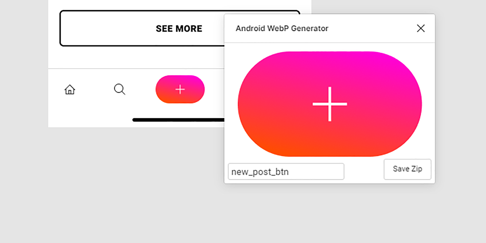

# Figma-Android-WebP-Generator

Converts any selected object into a webP file.

This plugin is specifically meant to be used for android development. 

The objects are saved into the default android resource folders:  
1x - drawable-mdpi  
1.5x - drawable-hdpi  
2x - drawable-xhdpi  
3x - drawable-xxhdpi  
4x - drawable-xxxhdpi  

Check out the plugin here:  
https://www.figma.com/community/plugin/842538740516209932/Android-WebP-Generator
